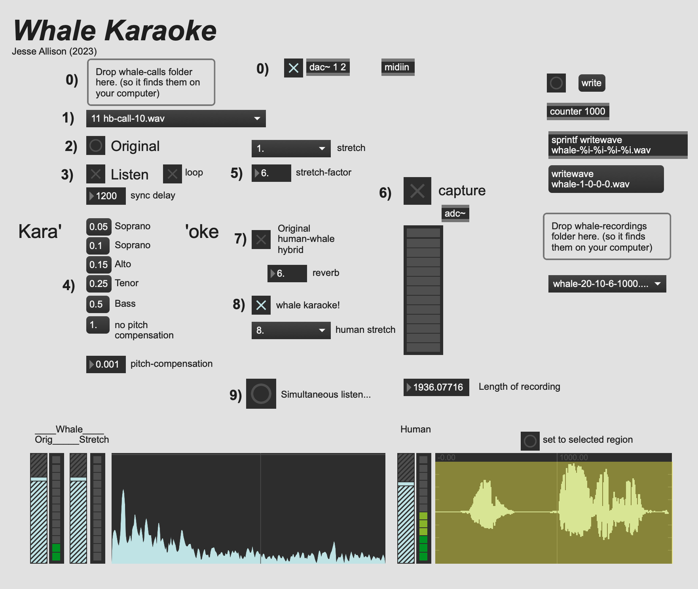

<head>
  <meta http-equiv="Permissions-Policy" content="interest-cohort=()">
</head>

# Whale Karaoke

| [Main](index.md) | 

What if we brought the whale song into the time and frequency domain of humans?  Can we then sing a whale song?  What if we transfer the song back into the whale's domain? How does our karaoke hold up to the original majestic song?  

### 09

Original: 

<audio src="./media/human-whale-hybrids/09/02 hb-call-1.wav" controls></audio>

Human:

<audio src="./media/human-whale-hybrids/09/whale-9-1-3-4.wav" controls></audio>

Human/Whale duet: 

<audio src="./media/human-whale-hybrids/09/whale-hybrid-9-1-3-4.wav" controls></audio>

### 16

Original: 

<audio src="./media/human-whale-hybrids/09/09 hb-call-8.wav" controls></audio>

Human:

<audio src="./media/human-whale-hybrids/09/whale-16-8-3-20.wav" controls></audio>

Human/Whale duet: 

<audio src="./media/human-whale-hybrids/09/whale-hybrid-16-8-3-20.wav" controls></audio>

### 20

Original: 

<audio src="./media/human-whale-hybrids/09/11 hb-call-10.wav" controls></audio>

Human:

<audio src="./media/human-whale-hybrids/09/whale-20-10-6-1000.wav" controls></audio>

Human/Whale duet: 

<audio src="./media/human-whale-hybrids/09/whale-hybrid-20-10-6-1000.wav" controls></audio>

## Karaoke Interface

